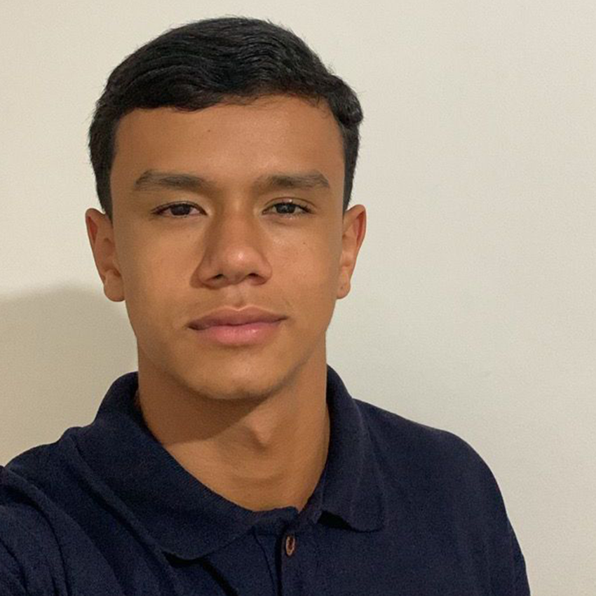
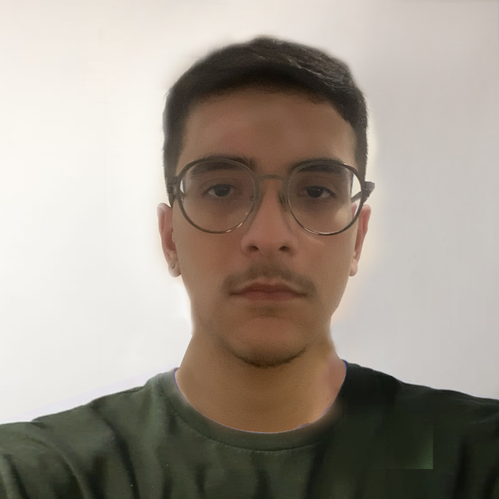

# AquaSafe - Solução Inteligente Contra Enchentes

AquaSafe é uma plataforma inovadora voltada para a prevenção de enchentes urbanas. Nosso objetivo é oferecer monitoramento em tempo real, alertas antecipados e informações críticas para proteger comunidades vulneráveis e seus patrimônios.

## 📚 Sobre o Projeto

O site apresenta de forma clara e interativa o problema das enchentes e como a tecnologia pode ser aplicada para mitigar seus efeitos. Utilizamos recursos modernos como:

- Sensores IoT para detecção de níveis de água.
- Inteligência Artificial para previsão de riscos.

Além disso, disponibilizamos um **Quiz interativo** para conscientização da população.

## 🎯 Funcionalidades

- 🌧️ **Informações sobre enchentes**: Contextualização do problema.
- 📡 **Tecnologias utilizadas**: Sensores IoT e Inteligência Artificial.
- 🎯 **Objetivos claros**: Reduzir danos e alertar com antecedência.
- 🧑‍🤝‍🧑 **Público-alvo**: Moradores de áreas de risco e defesa civil.
- ✅ **Benefícios diretos**: Segurança, planejamento urbano e tranquilidade.
- 📝 **Quiz Educativo**: Teste seus conhecimentos sobre prevenção de enchentes.
- 🌗 **Modo Escuro/Claro**: Personalize a visualização conforme sua preferência.
- 🎡 **Slider de Imagens**: Interface moderna com overlay de frase de impacto.

## 🚀 Tecnologias Utilizadas

- **HTML5**
- **CSS3**
- **JavaScript**
- **Bootstrap Icons**
- **Google Fonts** (Poppins e Open Sans)

## 🔗 Confira o projeto
Acesse aqui: https://globalsolution-alpha.vercel.app/index.html

## 📄 Licença
Este projeto é disponibilizado para fins **educacionais** e **não comerciais**.  
© 2025 AquaSafe — Todos os direitos reservados.

## 👥 Integrantes do Grupo
<table>
  <tr>
    <td align="center">
      
       
      Vitor Alcantara
       
      RM: 565885
       <a href="https://github.com/VitorAlcantara-tech" target="_blank">GitHub</a>
      • <a href="https://www.linkedin.com/in/vitor-alcantara" target="_blank">LinkedIn</a>
    </td>
    
  <td align="center">
      
       
      Thiago Lima
       
      RM: 563416
       <a href="https://github.com/thiagolima-tech" target="_blank">GitHub</a>
      • <a href="https://www.linkedin.com/in/thiago-lima-cavalcanti-8446bb317/" target="_blank">LinkedIn</a>
    </td>
    
  <td align="center">
      
       
      Matheus Vasques
       
      RM: 563309
       <a href="https://github.com/maatvasques" target="_blank">GitHub</a>
      • <a href="https://www.linkedin.com/in/matheus-vasques-santos-21a187357/">LinkedIn</a>
    </td>

    
